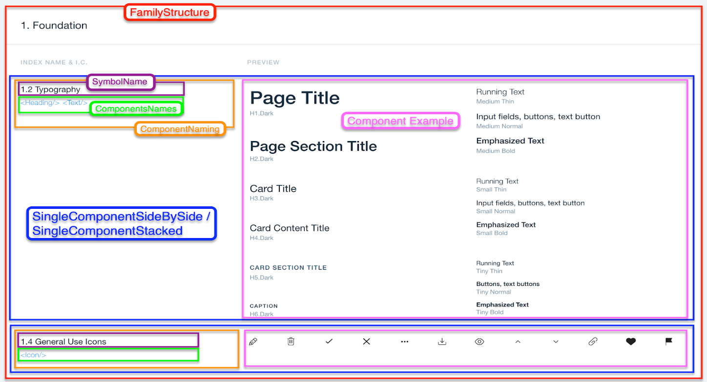

# Cheatsheet Contribution

## Symbols & Components Terminology

1. `Symbol` is the visual Sketch representation of the UI Component.
2. `Component` is the actual implementation of the UI element.
3. `Component Story` is the documentation page which explains how to use the component.
4. `UX Story` is the documentation page which reflects the `Symbol` constrains.

## Motivation
* **Components Inventory-** improving the components discoverability.
* **Mapping Symbol to Components-** making sure that we are aligned `Symbol <=> Component` as much as possible.
* **Source of truth**
* **Bridge the gap between the design and the actual implementation:**
    * Helping the FEDs to understand which components to use based on the UX symbol which is displayed in the Zeplin files.
    * Helping the UX Designers & Product to understand how the components behave and implemented.

## Contribution Guide

### Map the symbol to the components names:
1. Add a symbol name to `stories/symbolsComponentsMapping/symbols.js`.
2. Add the components used for this symbol to `stories/symbolsComponentsMapping/components.js`.
3. Add the `Symbol => Components` mapping to te relevant family file (listed under the `families` directory).
4. **(optional)** Add the actual symbol and / or actual component name `stories/symbolsComponentsMapping/storybookMapping.js`

**Note:** This mapping can be used to get the `Component` / `Symbol` URLs and therefore should be maintained.

### Add an example to the cheatsheet:

#### Shared UI elements arcitecture:
.

1. Use the shared UI Components listed under `stories/Introduction/Cheatsheet/sharedComponents` to design the example layout.
2. Import the new component to the relevant family file.
3. Get the relevant `Symbol => Components` mapping (Step 3 above).
4. Use the utils listed under `stories/Introduction/Cheatsheet/sharedComponents/utils.js` to link the symbols & components to the relevant documentation page.
5. Implement the example and add it to the `<FamilyStructure/>`.
